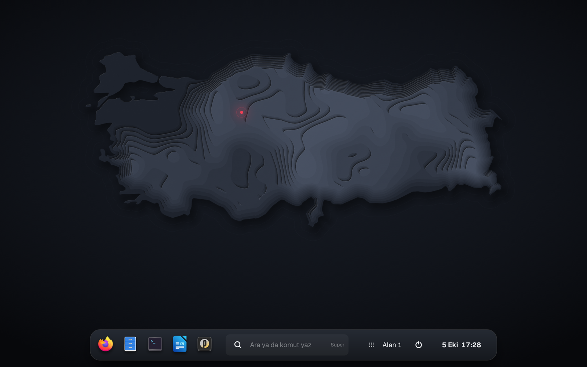

# VATAN

Pardus 25 için masaüstü oturumu. Üst bar yerine ekranın altında tek bir ada var: uygulamalar, Komut, alan düğmesi, durum ve saat. GNOME'un yanına ayrı bir oturum olarak kurulur; kabuğu `/usr/lib/vatan-shell` altına, oturum ve varsayılan dosyalarını kendi adıyla kurar, GNOME'un hiçbir dosyasını değiştirmez.


| Komut | Karanlık tema | Kilit ekranı |
|---|---|---|
|  |  |  |

- **Komut** — `Super` ile açılır. Uygulama, dosya, ayar ve hesap makinesi sonuçlarının yanında Türkçe eylemleri anlar: `karanlık`, `odak`, `gece ışığı`, `parlaklık 40`, `ses 30`, `yan yana diz`, `kilitle`.
- **Ada** — sık kullanılan ve çalışan uygulamalar, alan düğmesi, hızlı ayarlar ve saat tek yerde. Üstten ışık alan bir yüzey: ikonlar üzerine gelince yükselir, açılan uygulama zıplar. Menüler ve bildirimler adanın üstünde açılır.
- **Yerleştirme** — pencereyi ekran kenarına sürükle: yarım ekran; üst kenara: tam ekran.
- **Görünüm** — Geist ve Instrument Serif yazı tipleri, kat kat yükselen kabartma Türkiye haritası duvar kağıdı (açık ve koyu), kırmızı klasörlü VATAN simge teması. Kabuk, uygulamalar ve simgeler aynı kırmızıyı kullanır. Giriş doğrudan masaüstüne açılır.

## Kurulum

Gereken: Pardus 25 GNOME (amd64 ya da arm64).

1. [Sürümler](https://github.com/musstafasnn/vatan/releases) sayfasından mimarine uygun `vatan_*.deb` dosyasını indir.
2. Kur:

   ```sh
   sudo apt install ./vatan_0.1.0_amd64.deb
   ```

3. Oturumu kapat. Giriş ekranında kullanıcı adını seç, sağ alttaki dişli simgesinden **VATAN**'ı seç ve gir.

GNOME'a dönmek için aynı menüden **GNOME**'u seçmen yeterli.

### Kaldırma

```sh
sudo apt remove vatan
```

## Bilinen sınırlar

- Giriş ekranı Pardus'un giriş ekranıdır; VATAN görünümü giriş yaptıktan sonra başlar.
- Panelin, dock'un ya da genel bakışın yerine geçen eklentiler (dash-to-panel, dash-to-dock, blur-my-shell, ArcMenu ve benzerleri) ile masaüstü simgeleri VATAN oturumunda yüklenmez. GNOME oturumunda çalışmaya devam ederler.
- Komut'taki parlaklık eylemi yalnızca parlaklığı ayarlanabilen ekranlarda çalışır.
- Ayarlar GNOME oturumuyla ortaktır (dconf). VATAN'ın varsayılanları (vurgu rengi, yazı tipi, duvar kağıdı, sık kullanılanlar) yalnızca senin hiç değiştirmediğin anahtarlarda geçerlidir; birinde değiştirdiğin ayar ötekinde de değişir.
- Kabuk gnome-shell 48.7'nin çatalıdır: gnome-shell'e gelen güvenlik düzeltmeleri VATAN'a ancak yeni bir VATAN sürümüyle ulaşır.
- 0.1 Wayland oturumunda denendi. X11 oturumu ("VATAN (Xorg)") de kuruluyor ama daha az denendi.

## Kaynaktan derleme

Debian 13 ya da Pardus 25 üzerinde:

```sh
sudo apt install build-essential devscripts equivs
sudo mk-build-deps --install --remove debian/control
dpkg-buildpackage -us -uc -b
```

Paket bir üst dizine yazılır: `../vatan_0.1.0_<mimari>.deb`.

Duvar kağıtları `tools/wallpaper/generate.mjs` ile üretilir (Node 20+): `node tools/wallpaper/generate.mjs`.

## Depo düzeni

| Yol | İçerik |
|---|---|
| `shell/` | Kabuk: Pardus'un `gnome-shell 48.7-0+deb13u2pardus1` kaynak paketinin çatalı |
| `shell/js/ui/vatan/` | Ada, Komut ve eylem sağlayıcısı |
| `data/session/` | Oturum ve systemd kullanıcı birimleri |
| `data/90_vatan.gschema.override` | Yalnızca VATAN oturumunda geçerli varsayılanlar |
| `data/fonts/`, `data/backgrounds/` | Yazı tipleri ve duvar kağıtları |
| `data/icons/VATAN/` | Simge teması: Pardus klasörleri kırmızıya çevrilmiş hali (`tools/icons/recolor.mjs`) |
| `debian/` | `vatan` paketi |
| `shell/debian/` | Pardus'un gnome-shell paketlemesi; çatalın kaynağını belgelemek için duruyor, `vatan` paketini derlemez |

## Lisans

Kabuk GNU GPL 2 ya da sonrası (`LICENSE`). Geist ve Instrument Serif SIL Open Font License 1.1 (`data/fonts/`). Klasör simgeleri Pardus'un pardus-gnome-icon-theme paketinden, GNU GPL 3 ya da sonrası. Ayrıntılar `debian/copyright` içinde.

---

**English.** VATAN is a desktop session for Pardus 25 GNOME: a fork of gnome-shell 48 with a bottom island instead of the top bar and Komut, a command bar that understands Turkish actions. It installs next to GNOME as its own session (pick "VATAN" from the gear menu on the login screen) without modifying any GNOME file; settings are shared with the GNOME session through dconf. Install the `.deb` from Releases with `sudo apt install ./vatan_*.deb`.
