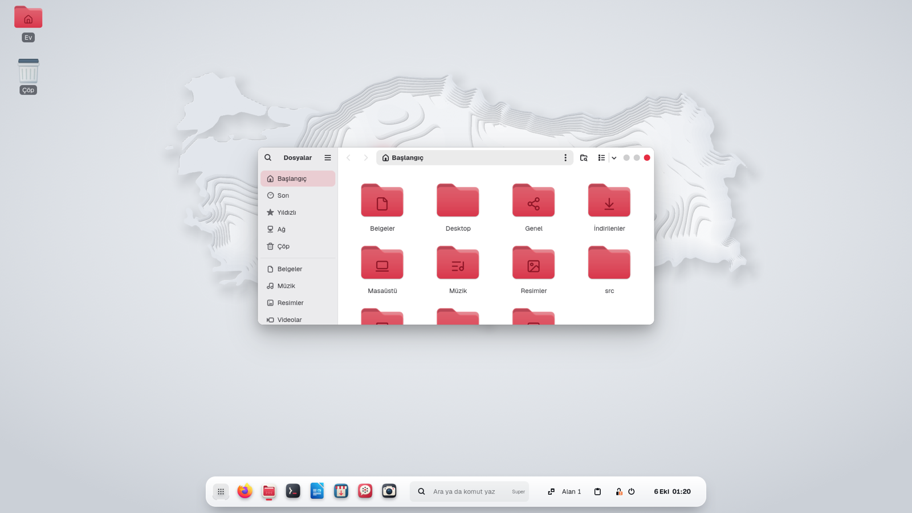
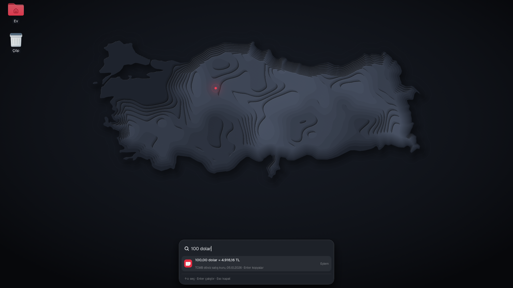
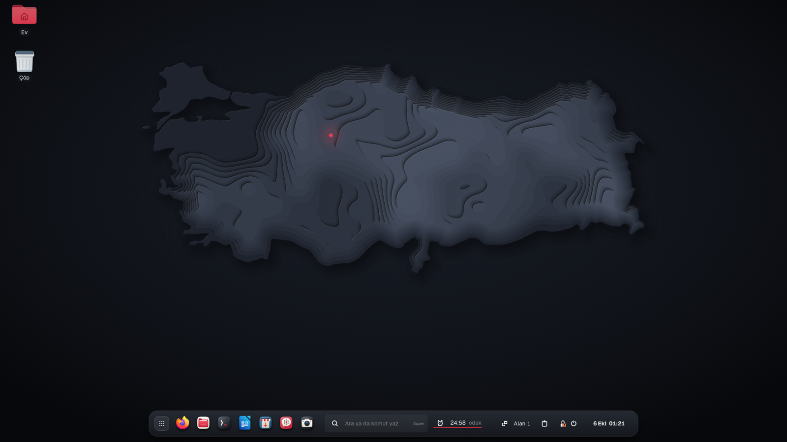
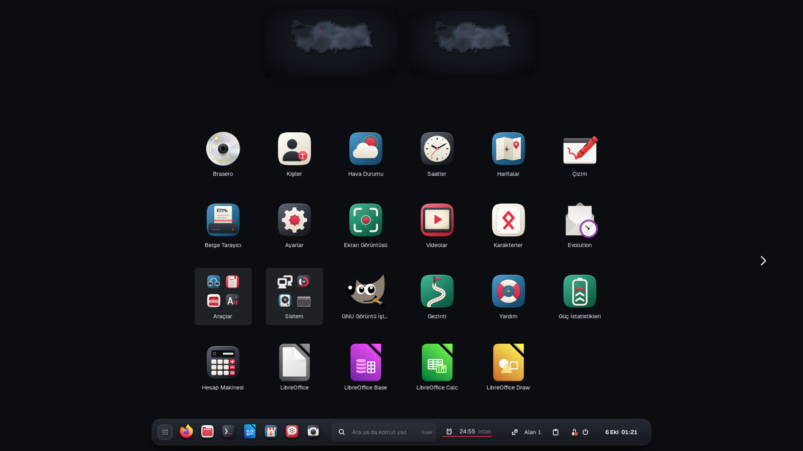
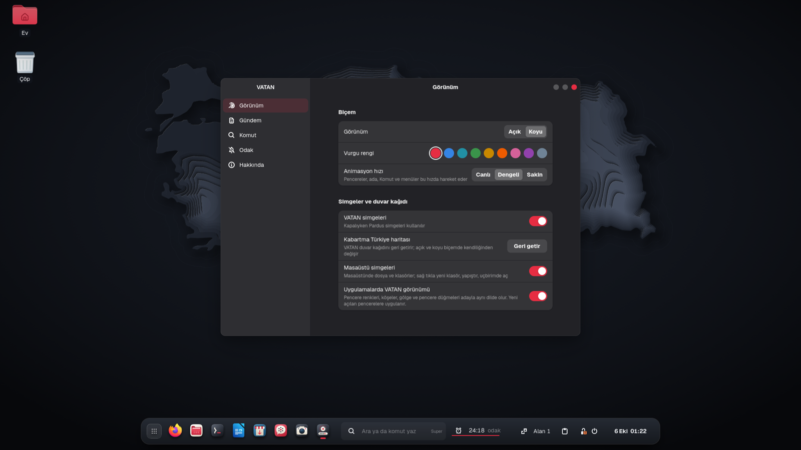
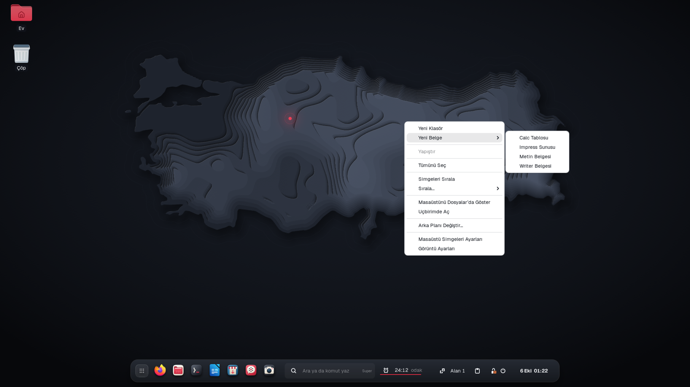
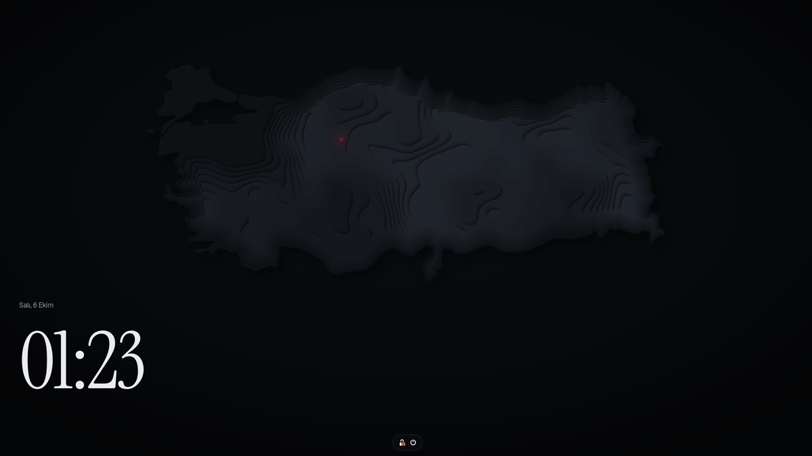

# VATAN

Pardus 25 için masaüstü oturumu. Üst bar yerine ekranın altında tek bir ada var: uygulamalar, Komut, alan düğmesi, durum ve saat. GNOME'un yanına ayrı bir oturum olarak kurulur; kabuğu `/usr/lib/vatan-shell` altına, oturum ve varsayılan dosyalarını kendi adıyla kurar, GNOME'un hiçbir dosyasını değiştirmez.



| Komut | Canlı Ada | Uygulamalar |
|---|---|---|
|  |  |  |

| VATAN Ayarları | Sağ tık: Yeni Belge | Kilit ekranı |
|---|---|---|
|  |  |  |

- **Komut** — `Super` ile açılır. Uygulama, dosya, ayar ve hesap makinesi sonuçlarının yanında Türkçe eylemleri anlar: `karanlık`, `odak`, `gece ışığı`, `parlaklık 40`, `ses 30`, `yan yana diz`, `kilitle`.
  - Kur ve birim: `100 dolar`, `1.000 tl euro` (TCMB döviz satış kuru), `5 km kaç mil`, `100 f c`. Enter sonucu kopyalar.
  - Kamu hizmetleri: `e-devlet`, `mhrs`, `e-nabız`, `e-okul`, `eba`, `uyap`, `vergi`.
  - Pardus araçları fiille: `biçimlendir`, `iso yaz`, `güncelle`, `donanım`, `uygulama kur`.
- **Ada** — sık kullanılan ve çalışan uygulamalar, alan düğmesi, hızlı ayarlar ve saat tek yerde. Üstten ışık alan bir yüzey: ikonlar üzerine gelince yükselir, açılan uygulama zıplar. Menüler ve bildirimler adanın üstünde açılır.
- **Canlı Ada** — müzik ya da video çalarken parça adada görünür; oynat/duraklat ve sonraki oradan. Komut'a `çay 3 dk`, `25 dakika odak`, `1 saat 30 dk` ya da `18:30 toplantı` yaz: ada geri sayımı ve kalan süreyi canlı gösterir, süre dolunca kırmızıya döner ve bildirim gönderir. Adadaki bölmeye tıklayınca kurulu zamanlayıcılar listelenir ve iptal edilebilir.
- **Gündem** — masaüstünde, pencerelerin altında son dakika başlıkları; tıklayınca haber tarayıcıda açılır. Varsayılan olarak kapalı; VATAN Ayarları → Gündem'den ya da Komut'ta `gündem` yazarak açılır. Kaynak `org.vatan.shell news-feed` ayarıyla değişir (yalnızca https).
- **NSosyal** — dock'ta ve Komut'ta tek tıkla NSosyal.
- **VATAN Ayarları** — biçem, vurgu rengi, VATAN simgeleri, kabartma duvar kağıdı, Gündem kaynağı, döviz kuru isteği ve tanıtım turu tek yerde; sistem ayarlarına da buradan geçilir.
- **VATAN Posta** — IMAP/SMTP posta uygulaması: hesap ve klasörler, ileti listesi ve okuma bölmesi yan yana; dar pencerede tek bölme. Yanıtla, tümünü yanıtla, ilet, ek gönder ve kaydet, klasörde konu/gönderen/gövde araması, çöpe taşıyıp geri alma. HTML iletilerde betik çalışmaz, uzak görseller sen izin verene kadar yüklenmez. Parola GNOME anahtarlığında durur; doğrulanamayan sunucu sertifikası parmak iziyle sorulur, kendiliğinden kabul edilmez. Kısayollar: `Ctrl+N` yeni, `Ctrl+R` yanıtla, `Ctrl+Shift+R` tümünü yanıtla, `Ctrl+L` ilet, `Delete` sil, `Ctrl+F` ara, `F5` yenile.
- **Pencere yerleşimi** — pencereyi ekran kenarına sürükle: yarım ekran; köşeye: çeyrek ekran. Yarım ekrandaki pencerede `Super+↑`/`Super+↓` üst/alt çeyreğe alır.
- **Hızlı Bakış** — Dosyalar'da bir dosyayı seçip boşluk tuşuna bas.
- **Pano geçmişi** — Komut'a `pano` yaz; son kopyaladıkların çıkar (yalnızca bellekte tutulur, parola yöneticilerinin gizli kopyaları alınmaz).
- **Zamanlı odak** — VATAN Ayarları → Odak: belirlediğin saatlerde bildirim balonları susar.
- **Uygulama görünümü** — VATAN oturumunda uygulama pencereleri adayla aynı dili konuşur: renkler, 12 px köşeler, derin gölge, iki gri ve bir kırmızı noktadan oluşan pencere düğmeleri. `~/.config/gtk-3.0/gtk.css` ve `gtk-4.0/gtk.css` dosyalarına tek bir içe aktarma bloğu eklenir; VATAN Ayarları'ndan kapatınca blok silinir. GNOME oturumunda uygulamalar kendi görünümünde kalır.
- **Tanıtım turu** — ilk girişte dört sayfalık kısa tur; Komut'ta `tur` yazarak yeniden açılır.
- **Uygulamalar** — adanın başındaki ızgara düğmesi bilgisayardaki tüm uygulamaları açar.
- **Görünüm** — Geist ve Instrument Serif yazı tipleri, kat kat yükselen kabartma Türkiye haritası duvar kağıdı (açık ve koyu), VATAN simge teması: sistem uygulamaları için sıfırdan çizilmiş, Selçuklu yıldızı, Orhun harfleri, İznik çinisi ve kilim motifleri taşıyan simgeler ve kırmızı klasörler. Kabuk, uygulamalar ve simgeler aynı kırmızıyı kullanır. Giriş doğrudan masaüstüne açılır.

## Kurulum

Gereken: Pardus 25 GNOME (amd64 ya da arm64).

1. [Sürümler](https://github.com/musstafasnn/vatan/releases) sayfasından mimarine uygun `vatan_*.deb` dosyasını indir.
2. Kur:

   ```sh
   sudo apt install ./vatan_0.1.0_amd64.deb
   ```

3. Oturumu kapat. Giriş ekranında kullanıcı adını seç, sağ alttaki dişli simgesinden **VATAN**'ı seç ve gir.

GNOME'a dönmek için aynı menüden **GNOME**'u seçmen yeterli.

### Açılış ekranı (isteğe bağlı)

Paket VATAN açılış ekranını kurar ama etkinleştirmez; açılış ekranı bütün kullanıcılar için ortaktır:

```sh
sudo plymouth-set-default-theme -R vatan
```

Geri almak için aynı komutu önceki temanın adıyla çalıştır (`plymouth-set-default-theme --list`).

### Giriş ekranı (isteğe bağlı)

Giriş ekranı da bütün kullanıcılar için ortak olduğundan VATAN onu kendiliğinden devralmaz:

```sh
sudo /usr/lib/vatan/vatan-login-screen enable    # VATAN çizsin
sudo /usr/lib/vatan/vatan-login-screen disable   # GNOME'a geri ver
```

Değişiklik GDM yeniden başlayınca ya da bilgisayar açılınca geçerli olur. Paket kaldırılırken bu ayar da silinir.

### Kaldırma

```sh
sudo apt remove vatan
```

## Bilinen sınırlar

- Giriş ekranı Pardus'un giriş ekranıdır; VATAN görünümü giriş yaptıktan sonra başlar.
- Panelin, dock'un ya da genel bakışın yerine geçen eklentiler (dash-to-panel, dash-to-dock, blur-my-shell, ArcMenu ve benzerleri) ile masaüstü simgeleri VATAN oturumunda yüklenmez. GNOME oturumunda çalışmaya devam ederler.
- Komut'taki parlaklık eylemi yalnızca parlaklığı ayarlanabilen ekranlarda çalışır.
- Kur çevirisi istendiğinde TCMB'nin günlük bültenine istek gider (saatte en fazla bir kez).
- Gündem kartı açıkken TRT Haber'e 15 dakikada bir istek gider; kapatınca hiç istek gitmez.
- NSosyal'ın herkese açık bir API'si olmadığı için kart NSosyal paylaşımlarını gösteremiyor; kısayol NSosyal'ı tarayıcıda açar.
- Ayarlar GNOME oturumuyla ortaktır (dconf). VATAN'ın varsayılanları (vurgu rengi, yazı tipi, duvar kağıdı, sık kullanılanlar) yalnızca senin hiç değiştirmediğin anahtarlarda geçerlidir; birinde değiştirdiğin ayar ötekinde de değişir.
- VATAN Posta yalnızca SSL/TLS ya da STARTTLS ile ve parolayla bağlanır. Gmail/Outlook gibi tarayıcı oturumuyla (OAuth) bağlanan Çevrimiçi Hesaplar hesapları listede görünür ama henüz açılmaz. Yeni posta 5 dakikada bir denetlenir (`org.vatan.posta refresh-minutes`, en az 2).
- Kabuk gnome-shell 48.7'nin çatalıdır: gnome-shell'e gelen güvenlik düzeltmeleri VATAN'a ancak yeni bir VATAN sürümüyle ulaşır.
- 0.1 Wayland oturumunda denendi. X11 oturumu ("VATAN (Xorg)") de kuruluyor ama daha az denendi.

## Kaynaktan derleme

Debian 13 ya da Pardus 25 üzerinde:

```sh
sudo apt install build-essential devscripts equivs
sudo mk-build-deps --install --remove debian/control
dpkg-buildpackage -us -uc -b
```

Paket bir üst dizine yazılır: `../vatan_0.1.0_<mimari>.deb`.

Duvar kağıtları `tools/wallpaper/generate.mjs` ile üretilir (Node 20+): `node tools/wallpaper/generate.mjs`.

## Depo düzeni

| Yol | İçerik |
|---|---|
| `shell/` | Kabuk: Pardus'un `gnome-shell 48.7-0+deb13u2pardus1` kaynak paketinin çatalı |
| `shell/js/ui/vatan/` | Ada, Komut ve eylem sağlayıcısı |
| `data/session/` | Oturum ve systemd kullanıcı birimleri |
| `data/90_vatan.gschema.override` | Yalnızca VATAN oturumunda geçerli varsayılanlar |
| `data/fonts/`, `data/backgrounds/` | Yazı tipleri ve duvar kağıtları |
| `data/icons/VATAN/apps/` | Sistem uygulaması simgeleri (`tools/icons/apps/build.mjs` üretir) |
| `data/icons/VATAN/places/` | Pardus klasörlerinin kırmızıya çevrilmiş hali (`tools/icons/recolor.mjs`) |
| `debian/` | `vatan` paketi |
| `shell/debian/` | Pardus'un gnome-shell paketlemesi; çatalın kaynağını belgelemek için duruyor, `vatan` paketini derlemez |

## Lisans

Kabuk GNU GPL 2 ya da sonrası (`LICENSE`). Geist ve Instrument Serif SIL Open Font License 1.1 (`data/fonts/`). Klasör simgeleri Pardus'un pardus-gnome-icon-theme paketinden, GNU GPL 3 ya da sonrası. Ayrıntılar `debian/copyright` içinde.

---

**English.** VATAN is a desktop session for Pardus 25 GNOME: a fork of gnome-shell 48 with a bottom island instead of the top bar and Komut, a command bar that understands Turkish actions. It installs next to GNOME as its own session (pick "VATAN" from the gear menu on the login screen) without modifying any GNOME file; settings are shared with the GNOME session through dconf. Install the `.deb` from Releases with `sudo apt install ./vatan_*.deb`.
